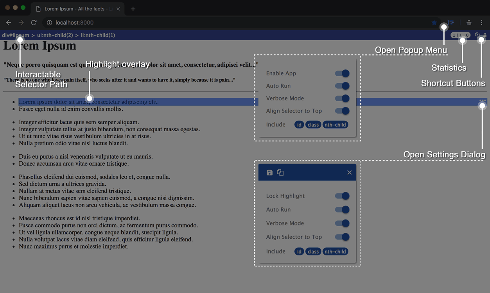
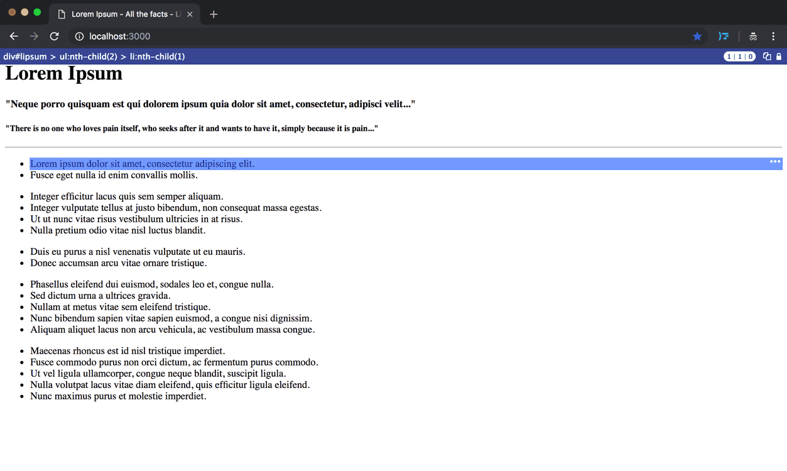
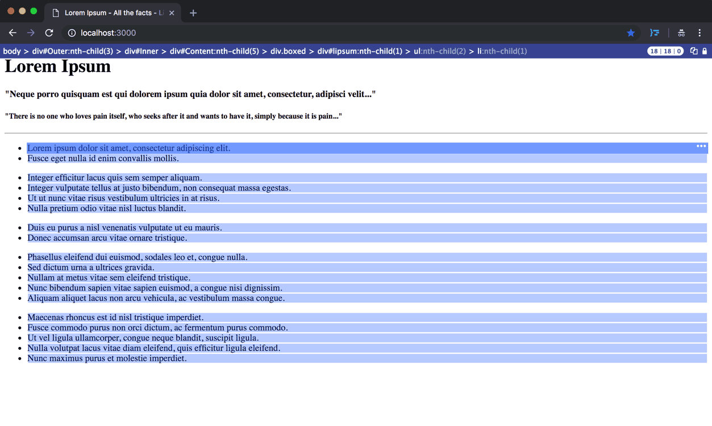
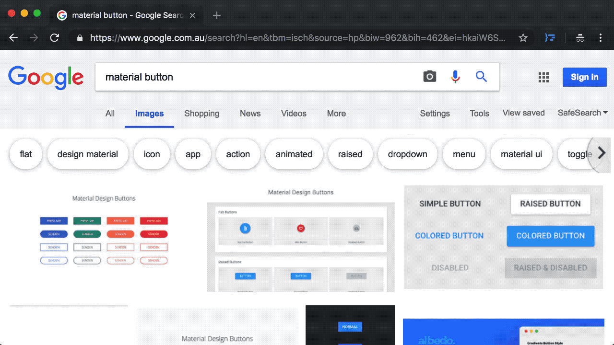
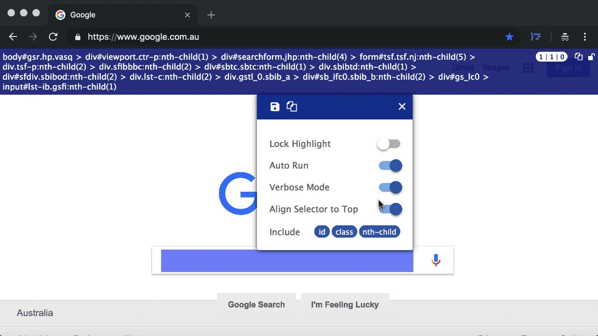
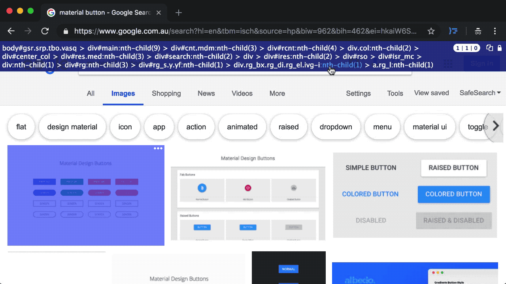
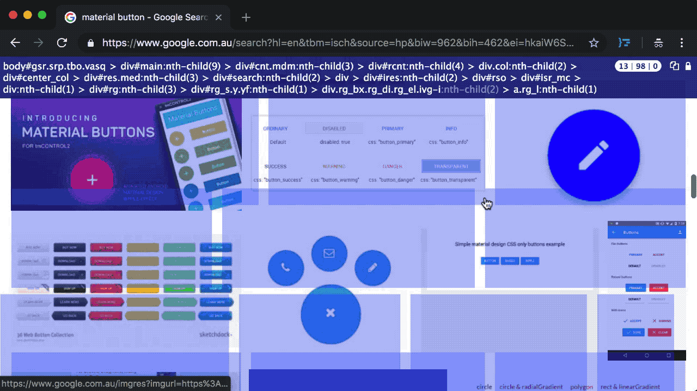

# Chrome Extension: CSS Selector Capture
User Manual and Support page for the CSS Selector Capture Chrome Extension

#### Links:
* [Chrome Extension Store Link](https://chrome.google.com/webstore/detail/cpnkcffhllafbdbljkmhebnpbnlhapmd)
* [Quick Tutorial Video (Youtube)](https://www.youtube.com/watch?v=kF5amjviiek)

#### Table of Contents:
* About the Extension
* Shortcut Hotkeys
* How UI is layouted and what each segment does
* Examples of the Extension in Use in a random dummy page
* FAQ 
* Privacy
* Issues/Support
* Release Notes

----------------

## About the Extension
* This is a free extension. It is a hobby project taken from a data scraping prototype I built a while back and until recently I decided to do it in a proper production standards. I am responsible for determining requirements/features, design and coding. Kudos to Google Material Design so that I don't have to be stuck at UI design process.
* What this plugin does:
    * shows you a copiable selector path when you hover an element in the page without opening the devtool 
    * highlights the target & any matches that fit the profile of the selector path
    * allows you to interact with the selector to find relevant matches in the page within the viewport context
* The extension is focused on getting the selector of a VISIBLE element in the page as a starting point, not entering a custom selector first to find matches. I would imagine the extension would suit the use of Front End Developers and/or data scraping purpose where finding selector, target or matches are quite demanding. 
* The extension is written with TypeScript/jQuery/AngularJs and unit tested using Jasmine. Angular 5/6 was investigated but not going forward as the final choice due to achieving the compatibility with existing App or library in User's page. The extension has been tested  in the browser (Chrome v.68+ in MacOs and Windows) & in Unit tests ([Test Report](./ref/test-report.md), about 300 tests with 97% coverage), there are always possible edge cases that haven't been accounted for. Please submit any issue in case you bump into any bug. Also feel free to drop me a message on LinkedIn and let me know what you think!

## Shortcut Hotkeys (only when app is enabled)
* `CTRL` for locking and unlocking the overlays in position
* `ESC` for disable/exit the Extension

## UI Layout (within app element added to the DOM by the Extension)

1. **Extension Icon (Popup Menu)**

    This contains the global settings. Any changes made here is automatically saved to Chrome storage. 
    
    - Enable App Switch: 

        This allows you to enable/disable the app/extension for the current page. Alternatively to disable the app, you can also use the "ESC" key in the page.
    
    - Auto Run Switch: 

        When this is on, it will automatically start the app when the page loads, that means you will see the highlight/overlay as soon as you hover an element.

    - Align Selector to Top: 

        Place the selector bar either at the top (on) or bottom (off).
    
    - Verbose Mode Switch: 

        This essentially determines whether the selector path is "concise" or not. In non-verbose mode, it would be more concise when you have for example an unique id, e.g. `div#lorem-sum` whereas Verbose mode will generate the selector all the way up to `<body>` tag, e.g. `body > div#lorem-sum.someclass:nth-child(10)`. When finding matches, verbose mode can be very useful in observing the variations of the selector for each hover target thus finding the desire matched elements.    
    
    - Include Options: 

        These options are for Verbose Mode only and for the last "item", i.e. the hover target only, not its ancestors. Again this is useful for quickly finding matches such as all the `li` in `ul`. The reason why this doesn't apply for all id or class or nth-child up the chain is that if we do that, every time you hover a new element you may end up with so many matches at the beginning which will impact the performance. Keeping it like so will keep some level of "uniqueness" for the selector.

2. **Interactive Selector Path**

    This is generated based on the element you hover on. It will update whenever you hover on a new target element given when the highlight is not locked. The selector path is entirely interactive and customizable (once you hover a target), meaning you can turn on/off a tag, a id, a class or classes and nth-child or even the arrow to find the matches in the page. By default it starts with a verbose path and let you trim it down to customize.

3. **Selector Stats (3 numbers)**
    - 1st number: 
    no. of overlays in the viewport

    - 2nd number: 
    no. of overlays matched the selector (beware this may not include the hover target element if you made significant change to the selector path, for example, when you turn off one direct descendant arrow and the anchor tag, like so: `div > a > p` becomes `div > p`.)
    
    - 3rd number: 
    no. of matched elements that are hidden (therefore no overlays)

4. **Shortcut Buttons (copy selector, lock/unlock highlight position)**

    Quick access to the copy selector and lock highlight buttons. These are useful when you have lost track of the original hovered target element visually. For example, when the hover element is no longer in viewport, it is easier to unlock or copy the selector from there. Notice the lock/unlock toggle can also be accessed via `CTRL` key.

5. **Highlight Overlay**

    An overlay that indicates either the hover target element or the matched elements (based on the selector). The overlay for the target element has a more saturated color and also has a triple dots button for opening up the settings dialog. 

6. **Settings Dialog**

    This is essentially the same as the one in Popup menu. The only difference is you need click the "save" button in order to save the settings. This offers a flexible setting option when you are experimenting with the selector and the highlights.

    - Lock Hilight Switch: 

        This allows you to lock/unlock the current overlays. It can also be done via `CTRL` key. Note this is specific to the page therefore it is not available as a general option from the Extension Icon Popup menu.

## Examples
1. Example showing a non-verbose selector (with id) for hovered element

2. Example showing a verbose selector that has been tweaked to find matched elements

3. Example showing feature where selector updates on mouseover

4. Example showing feature where selector is switched between verbose and non-verbose mode

5. Example showing feature where selector is interacted/tweaked to find multiple matches

6. Example showing feature where statistics and highlights of matches are updated when window is scrolled (in which content is lazy loaded) 

## FAQ
* Features Considerations:
    * Extension in Mobile Emulation (considered & will not be in feature)
        * The extension works normal under the "responsive mode" however not in Mobile becuase in mobile it is an entirely different context since we are dealing with `touchstart` etc, which means requiring User to tap on the element. It is quite different to what we are using in Desktop which is `mouseover`. Apart from potential switching the event context, the mobile screen size may also be too small to work with, especially when the selector path may take up a lot of screen realestate.
    * Development for Safari and Firefox
        * I haven't investigated how similar the API will be however if there is not much variations in the implementation then it will definitely be possible down the track. The goal is to keep the same codebase or almost same codebase at least.
* In the case of event is not getting picked up in some pages due to `evt.stopImmediatePropagation()`, such as the `mouseover` event please send me the page URL and steps to reproduce the issue. I already have a mechanism for dealing this scenario though for now I am not including as it involves the override of `Event.prototype.stopImmediatePropagation`.

## Privacy
* The extension does NOT collect any data or send data to third party. 
* If concerned, as a good security measure, Users can always assume all extensions as non-secure and disable them without any exceptions especially before logging in to any sites (Simply turn them off in Chrome Extension Management Page).

## Issues/Support
* As majority of time is spent prior to initial release, I am transitioned to casual maintenance for this project. Any future feature request will still be considered as whether it should go in the next release. For now the next version release interval would be somewhere in 3-6 months, unless for critical hotfix.
* For bugs/issues, please provide details and try to be as specific as possible. For example:
    * URL
    * Steps to reproduce the issue
    * What should be expected and what is the actual result
    * etc

## Release Notes
* 2.1.0 (2019.03.21)
    * Added a shortcut hotkey (CTRL) for locking toggle of the overlays
* 2.0.0 (2019.02.25)
    * Optimization for concise selector (i.e. shorter)
    * Adjustment of selector background opacity when Popup button is on top and user hovers it
* 1.0.3 (2018.10.15)
    * Optimization for selector retrieval
* 1.0.0 (2018.09.29)
    * Initial Release